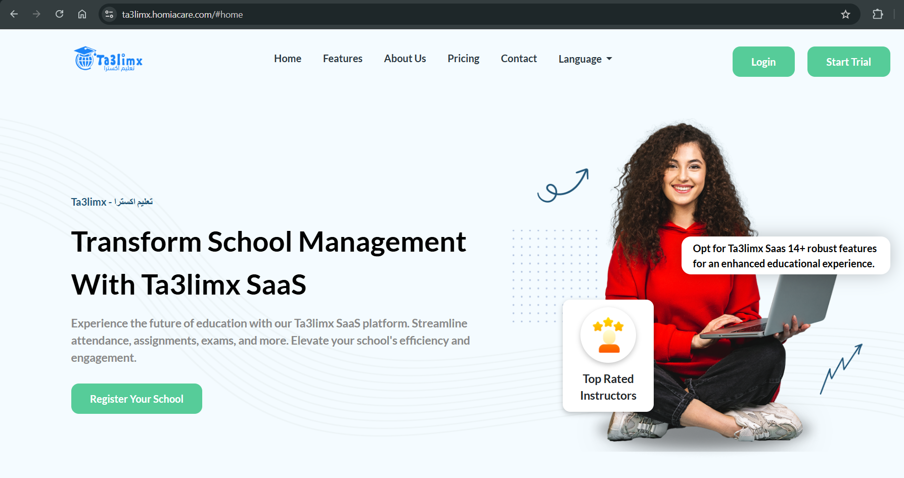
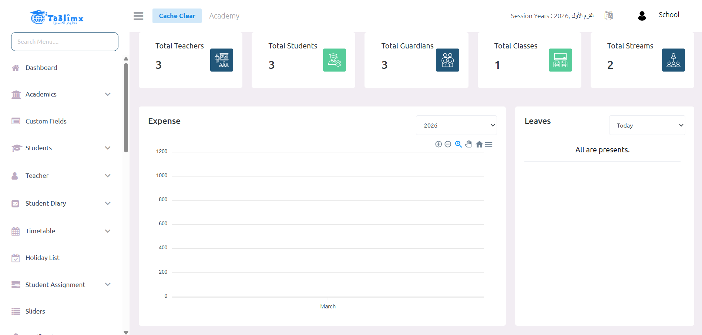
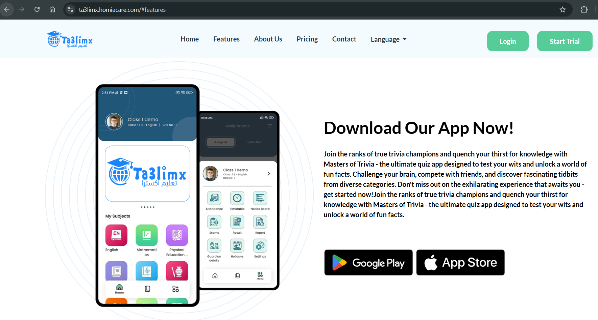
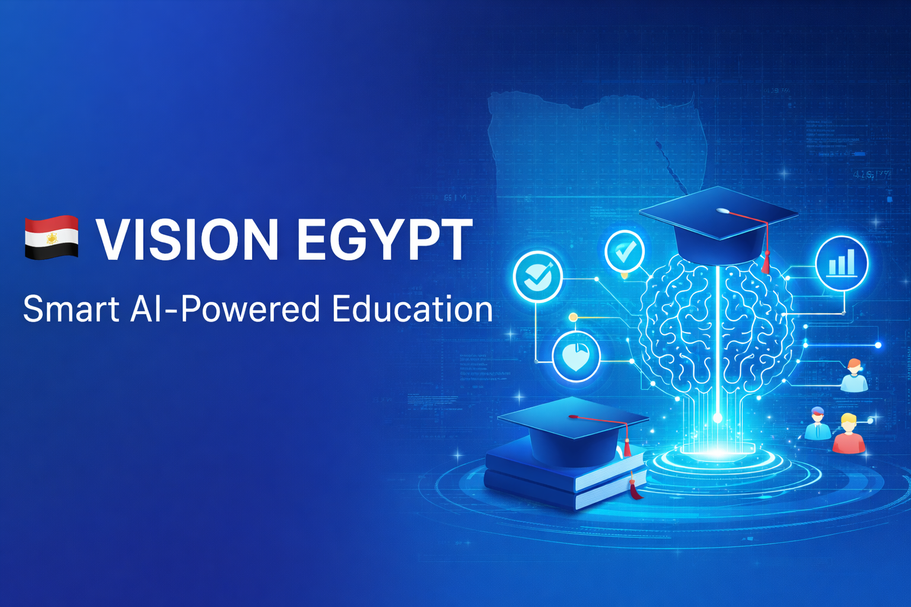

# 🎓 Ta3limX  
### Smart School Management System

```bash
████████╗ █████╗ ██████╗ ██╗     ██╗███╗   ███╗██╗  ██╗
╚══██╔══╝██╔══██╗██╔══██╗██║     ██║████╗ ████║╚██╗██╔╝
   ██║   ███████║██████╔╝██║     ██║██╔████╔██║ ╚███╔╝ 
   ██║   ██╔══██║██╔═══╝ ██║     ██║██║╚██╔╝██║ ██╔██╗ 
   ██║   ██║  ██║██║     ███████╗██║██║ ╚═╝ ██║██╔╝ ██╗
   ╚═╝   ╚═╝  ╚═╝╚═╝     ╚══════╝╚═╝╚═╝     ╚═╝╚═╝  ╚═╝
```


---

## 📌 Overview
**Ta3limX** is an AI-powered smart school management system that enhances learning, automates administration, and connects students, teachers, and parents in one unified platform.

---

## 🤖 AI Features
- 🎯 Smart student performance analysis  
- 📊 Predictive analytics for grades  
- 🧠 Personalized learning recommendations  
- ⚡ Early warning system for struggling students  

---

## ⚙️ Core Features
- 👨‍🎓 Student Management System (SIS)  
- 👨‍🏫 Teacher Dashboard  
- 👨‍👩‍👧 Parent Portal  
- 📊 Reports & Analytics  
- 🗂️ Attendance & Exams Management  

---

## 📸 Screenshots


<p align="center">
  
</p>

<p align="center">
  
</p>

<p align="center">
  
</p>
---

## 🚀 Getting Started

```bash
git clone https://github.com/your-username/ta3limx.git
cd ta3limx

composer install
cp .env.example .env
php artisan key:generate

php artisan migrate
php artisan serve
```

---

## 🧪 Running Tests

```bash
php artisan test
```

---

## ⚙️ CI/CD (GitHub Actions)
This project uses GitHub Actions for automated testing on every push.

---

## 👨‍💻 Vision
 <p align="center">
  
</p>


---

## 📄 License
MIT License
Ta3limX also incorporates data-driven analytics and is designed to support future AI-powered insights for predicting student performance and improving educational outcomes.
By digitizing school operations and improving transparency, Ta3limX contributes to modernizing education and aligns with digital transformation goals such as Egypt Vision 2030.
